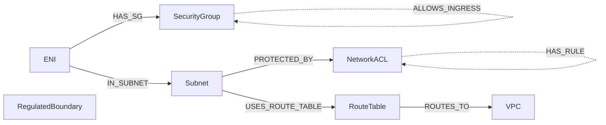

# Graph Schema

Authoritative model description for the aws-net-hound Neo4j graph. Cypher
migrations (`migrations/`) and Rust domain types (`crates/core/src/domain/`)
are derived **from** this document, not the other way round. If they drift,
this file wins and the code is the bug.

All example IDs below are synthetic placeholders — `123456789012`,
`eni-0example`, etc. — never real account IDs or ARNs.

## Diagram

All seven node types and both edge categories — topology edges as solid
lines, evaluable-rule edges as dashed lines:

`RegulatedBoundary` is drawn with no edges — see below, it correlates by
`id` rather than by graph traversal in this milestone.

## Why `SecurityGroup` and `NetworkACL` are separate layers

This looks like redundancy — both are "a bag of rules attached to
network traffic" — but the two evaluate completely differently, and
collapsing them into one node type would make correct evaluation
impossible:

- **`SecurityGroup`** is an **unordered union of allow rules**. There is
  no deny rule and no rule ordering — every matching `ALLOWS_EGRESS` /
  `ALLOWS_INGRESS` edge independently grants traffic, and evaluation is
  simply "does at least one rule match."
- **`NetworkACL`** is an **ordered, first-match evaluation over allow
  *and* deny rules**, keyed by `HAS_RULE.rule_number` ascending. The
  first rule that matches wins, whether it allows or denies, and every
  rule after it is irrelevant for that packet.

An evaluator that treated both as "a set of allow rules" would produce
false negatives for NACLs (missing explicit denies) and false positives
for order-dependent NACL rules (evaluating them as if every rule applied
independently, like an SG). The two node types exist because their
evaluation semantics are genuinely different, not because the schema
needed two ways to say the same thing.

## Nodes

Every node's first property is its **unique key**: the AWS resource ID for
AWS-native resources, sourced verbatim from the relevant `Describe*` API
response. Uniqueness constraints on this key, and indexes on `account_id` /
`vpc_id`, are asserted in `migrations/0001_constraints.cypher` and
`migrations/0002_indexes.cypher` (M0-T3).

### `ENI`

| Property      | Type   | Required | Source                                  |
|---------------|--------|----------|------------------------------------------|
| `id`          | String | yes (key)| `NetworkInterfaceId`, e.g. `eni-0example`|
| `account_id`  | String | yes      | ingestion context (AWS account audited) |
| `vpc_id`      | String | yes      | `VpcId`                                  |
| `subnet_id`   | String | yes      | `SubnetId`                               |
| `private_ip`  | String | yes      | `PrivateIpAddress`                       |
| `description` | String | no       | `Description`                            |

### `SecurityGroup`

| Property      | Type   | Required | Source                                    |
|---------------|--------|----------|---------------------------------------------|
| `id`          | String | yes (key)| `GroupId`, e.g. `sg-0example`               |
| `account_id`  | String | yes      | ingestion context                          |
| `vpc_id`      | String | yes      | `VpcId`                                     |
| `name`        | String | yes      | `GroupName`                                |
| `description` | String | no       | `Description`                              |

### `NetworkACL`

| Property     | Type   | Required | Source                              |
|--------------|--------|----------|---------------------------------------|
| `id`         | String | yes (key)| `NetworkAclId`, e.g. `acl-0example`   |
| `account_id` | String | yes      | ingestion context                    |
| `vpc_id`     | String | yes      | `VpcId`                              |
| `is_default` | bool   | yes      | `IsDefault`                          |

### `Subnet`

| Property            | Type   | Required | Source                                     |
|---------------------|--------|----------|-----------------------------------------------|
| `id`                | String | yes (key)| `SubnetId`, e.g. `subnet-0example`            |
| `account_id`        | String | yes      | ingestion context                            |
| `vpc_id`            | String | yes      | `VpcId`                                      |
| `cidr_block`        | String | yes      | `CidrBlock`                                  |
| `availability_zone` | String | yes      | `AvailabilityZone`                           |

`cidr_block` and `availability_zone` have no data source until a
`DescribeSubnets` collector exists (a later milestone) — `crate::ingest`
only collects `DescribeSecurityGroups`/`DescribeNetworkAcls`/
`DescribeRouteTables`/`DescribeNetworkInterfaces`/`DescribeVpcPeeringConnections`.
Until then, `topology.rs::build_graph_batch` (M1-T4) emits `Subnet` nodes
synthesized from `subnet_id` sightings on `NetworkInterface`/
`NetworkAclAssociation`/`RouteTableAssociation`, with these two fields as
empty strings. `vpc_id` is **not** part of this gap: AWS guarantees a
NACL's/route table's/ENI's own `vpc_id` matches its associated subnet's
VPC, so it is reliably inferred without a `Subnet` API call.

### `VPC`

| Property     | Type   | Required | Source                            |
|--------------|--------|----------|--------------------------------------|
| `id`         | String | yes (key)| `VpcId`, e.g. `vpc-0example`         |
| `account_id` | String | yes      | ingestion context                   |
| `cidr_block` | String | yes      | `CidrBlock`                         |

`cidr_block` has the same gap as `Subnet.cidr_block` above: no
`DescribeVpcs` collector exists yet, so `topology.rs::build_graph_batch`
emits it as an empty string, deriving the node itself from `vpc_id`
sightings across the five collectors it does have (ENI, SecurityGroup,
NetworkACL, RouteTable, and the same-account side of VpcPeeringConnection).

### `RouteTable`

| Property     | Type   | Required | Source                                  |
|--------------|--------|----------|--------------------------------------------|
| `id`         | String | yes (key)| `RouteTableId`, e.g. `rtb-0example`        |
| `account_id` | String | yes      | ingestion context                         |
| `vpc_id`     | String | yes      | `VpcId`                                   |
| `is_main`    | bool   | yes      | derived from `Associations[].Main`        |

### `RegulatedBoundary`

Not an AWS-native resource — a user-defined label for any compliance
perimeter the audit evaluates against (PCI-DSS cardholder data environment
is one example; HIPAA, SOC 2, or an internal segmentation policy are
others). Its key is operator-assigned, not sourced from AWS.

| Property     | Type   | Required | Source                                          |
|--------------|--------|----------|----------------------------------------------------|
| `id`         | String | yes (key)| operator config, e.g. `boundary-pci-prod`          |
| `account_id` | String | yes      | operator config                                    |
| `name`       | String | yes      | operator config, human label                       |
| `regime`     | String | yes      | operator config, e.g. `PCI-DSS` (freeform, not an enum — the regime is a label, not a system behavior) |
| `description`| String | no       | operator config                                    |

`RegulatedBoundary` carries no topology or rule edge in this milestone.
Reachability findings correlate against it by `id` via
`ReachabilityFinding.destination_boundary` (M0-T5) — evaluation matches on
this key, not graph traversal. A containment edge (e.g. boundary → subnet)
may be added in a later milestone if the evaluator needs to traverse to it
directly; until then this is a deliberate scope boundary, not an oversight.

## Edges

### Topology

Structural wiring of the network — how traffic could physically flow before
any allow/deny rule is applied.

| Edge               | Direction                    | Properties |
|---------------------|-------------------------------|------------|
| `HAS_SG`            | `ENI` → `SecurityGroup`       | none — membership only |
| `IN_SUBNET`         | `ENI` → `Subnet`              | none |
| `PROTECTED_BY`      | `Subnet` → `NetworkACL`       | none |
| `USES_ROUTE_TABLE`  | `Subnet` → `RouteTable`       | none |
| `ROUTES_TO`         | `RouteTable` → target*        | `destination_cidr: String` — the route's destination CIDR |

\* `ROUTES_TO` target is whatever the route resolves to in the graph: a
`VPC` node for a local route, or an unresolved external target (internet
gateway, NAT gateway, peering connection) which is out of scope for node
modeling in this milestone and is instead recorded as `destination_cidr`
with no destination node, plus a `resolved: bool` property (`false` when
the target does not resolve to a modeled node). Since a Neo4j relationship
always requires two endpoints, "no destination node" is written as a
self-loop on the source `RouteTable` — the same Cypher-level trick used for
`HAS_RULE` below. The `resolved`/`destination_cidr` properties, not the
edge's endpoints, are the source of truth for whether a real destination
exists.

| Edge (cont.) | Properties (cont.) |
|---|---|
| `ROUTES_TO` | `resolved: bool` — `false` when the destination is outside the modeled node types |

A route table association with `main: true` and no explicit `subnet_id`
(AWS's implicit form, covering every subnet in the VPC not explicitly
associated elsewhere) is recorded via `RouteTable.is_main = true` on the
node itself, not as a `USES_ROUTE_TABLE` edge — there is no concrete subnet
to key that edge on without a `DescribeSubnets` collector (see `Subnet`'s
gap note above). A later milestone that adds subnet enumeration can
retroactively emit the implied edges once every subnet in the VPC is known.

A route whose only destination is a `destination_prefix_list_id` (no
`destination_cidr_block`/`destination_ipv6_cidr_block`, e.g. a gateway VPC
endpoint route) is not modeled in this milestone and produces no
`ROUTES_TO` edge — there is no CIDR to key the edge's required
`destination_cidr` on.

### Evaluable rules

Allow/deny rules the Milestone 2 evaluator intersects. Structurally these
mirror `crates/core/src/domain/rule.rs`'s `SgRule` and `NaclRule` — field
names below must match those struct field names exactly (M0-T5 acceptance
criteria).

| Edge             | Direction                                  | Properties |
|-------------------|---------------------------------------------|------------|
| `ALLOWS_EGRESS`   | `SecurityGroup` → target*                   | see below |
| `ALLOWS_INGRESS`  | `SecurityGroup` → target*                   | see below |
| `HAS_RULE`        | `NetworkACL` → `NetworkACL` (self-edge)†    | see below |

\* Target is one of two mutually exclusive forms — never both at once:
- **CIDR**: no destination node; `target_kind = "cidr"`, `cidr` populated.
- **SecurityGroup reference**: destination node is another `SecurityGroup`;
  `target_kind = "security_group_ref"`, `cidr` absent. If the reference is
  cross-account and cannot be dereferenced (local-audit mode), the edge is
  still written with `resolved = false` rather than failing ingestion.

As with `ROUTES_TO` above, the CIDR form (and an unresolved SecurityGroup
reference) has no real destination node, so it is written as a self-loop on
the source `SecurityGroup` — a Neo4j relationship always needs two
endpoints. `target_kind`/`cidr`/`resolved`, not the edge's endpoints, carry
the actual target semantics.

`ALLOWS_EGRESS` / `ALLOWS_INGRESS` properties:

| Property      | Type    | Required | Notes |
|---------------|---------|----------|-------|
| `protocol`    | String  | yes      | e.g. `tcp`, `udp`, `-1` for all |
| `from_port`   | Int     | no       | absent when protocol has no ports (e.g. `-1`) |
| `to_port`     | Int     | no       | same as above; `from_port <= to_port` when both present |
| `target_kind` | String  | yes      | `"cidr"` \| `"security_group_ref"` |
| `cidr`        | String  | no       | present only when `target_kind = "cidr"` |
| `resolved`    | bool    | yes      | `false` = reference could not be dereferenced; treat as indeterminate, never dropped |

† `NetworkACL` has no separate rule node type, so each rule is a self-edge
carrying every field of the rule as edge properties — there is nothing on
the other end to model. This is a deliberate modeling choice, not a
placeholder: it keeps `NaclRule` a flat, orderable list per ACL without
inventing an eighth node type the rest of the schema doesn't need.

`HAS_RULE` properties:

| Property      | Type    | Required | Notes |
|---------------|---------|----------|-------|
| `rule_number` | Int     | yes      | **ordered integer**, evaluation-order key. Never inferred from insertion order — first match by ascending `rule_number` wins. |
| `direction`   | String  | yes      | `"ingress"` \| `"egress"` |
| `protocol`    | String  | yes      | e.g. `tcp`, `udp`, `-1` for all |
| `from_port`   | Int     | no       | absent when protocol has no ports |
| `to_port`     | Int     | no       | same as above |
| `cidr`        | String  | yes      | NACL rules are always CIDR-based, no SG reference form |
| `action`      | String  | yes      | `"allow"` \| `"deny"` — never a bool, there is no implicit third state to collapse |

### Struct-to-property crosswalk (M0-T5)

`crates/core/src/domain/rule.rs` and `crates/core/src/domain/finding.rs` are
derived from this document; field names match exactly.

- `SgRule` ↔ `ALLOWS_EGRESS` / `ALLOWS_INGRESS`: `protocol`, `resolved`
  match directly; `from_port`/`to_port` are `#[serde(flatten)]`-ed from
  `port_range: Option<PortRange>` so they serialize as flat properties;
  `target_kind`/`cidr` are similarly flattened from the `target: RuleTarget`
  enum (`Cidr { cidr }` | `SecurityGroupRef { security_group_id }`).
  `SgRule.direction` and `RuleTarget::SecurityGroupRef.security_group_id`
  have **no property counterpart** — `direction` selects the
  `ALLOWS_EGRESS`/`ALLOWS_INGRESS` edge type, and `security_group_id`
  selects the destination `SecurityGroup` node. The M1 writer consumes
  both to pick edge type and endpoint and does not persist them as
  properties.
- `NaclRule` ↔ `HAS_RULE`: `rule_number`, `direction`, `protocol`, `cidr`
  match directly; `from_port`/`to_port` are `#[serde(flatten)]`-ed from
  `port_range: Option<PortRange>`; `action` is the `Action` enum (`Allow` |
  `Deny`) rather than the edge's `"allow"` \| `"deny"` string. Unlike
  `SgRule`, `NaclRule.direction` *is* a `HAS_RULE` property (the self-edge
  carries both directions' rules), so it round-trips as-is.
- `ReachabilityFinding` (Milestone 2 evaluator output, no corresponding
  graph edge yet — computed at query time, not stored): `computed_at`,
  `source`, `destination_boundary` are direct fields; `path_evidence` is a
  structured `PathEvidence { hops: Vec<Hop> }` listing each traversed
  node's id and kind, not a pre-rendered string; `severity` is the
  `Severity` enum (`Low` | `Medium` | `High` | `Critical`).

## Cross-cutting notes

- `rule_number` (on `HAS_RULE`) is stored as an **ordered integer** and is
  never inferred from Cypher return order, list position, or insertion
  order. Any code that sorts NACL rules must sort explicitly on this field.
- `resolved: bool` (on `ALLOWS_EGRESS`, `ALLOWS_INGRESS`, `ROUTES_TO`) marks
  references that could not be resolved — most commonly a cross-account
  security-group reference in local-audit mode — **without failing
  ingestion**. An unresolved rule is indeterminate, not absent, and must be
  surfaced to the evaluator as such.
- `account_id` and `vpc_id` are carried directly on every node type that
  has them (all except `RegulatedBoundary`, which has no `vpc_id`) so
  reachability queries can filter without a join back to `VPC`.
  `migrations/0002_indexes.cypher` indexes both fields on the node types
  that carry them, plus `resolved` on `ALLOWS_EGRESS` / `ALLOWS_INGRESS`.
